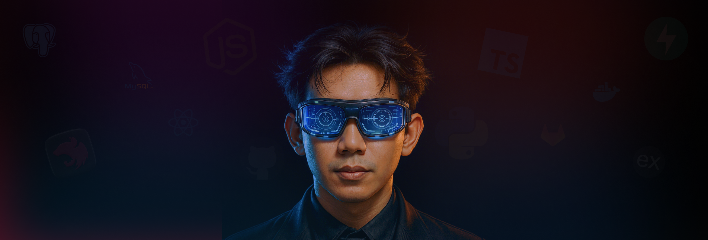

# 👋 Hi, I'm Tamam Huda (Uta Dev)

---

## 🧑‍💻 About Me

Backend Developer with experience in scalable backend systems for web and mobile. Skilled in RESTful APIs, relational databases, and asynchronous task integration. Proficient in cloud infrastructure and modern backend stacks. Committed to clean architecture and efficient coding practices.

---

## 🛠️ Skills & Technologies

### ⚙️ Backend (Main)
- **Languages:** Python, TypeScript, JavaScript, Java  
- **Frameworks:** Django, Flask, FastAPI, NestJS, ExpressJs, Spring Boot  
- **API:** REST API, GraphQL  
- **Databases:** PostgreSQL, MySQL, MongoDB 
- **ORMs:** Prisma, TypeORM, SQLAlchemy, Django ORM, Pydantic  
- **Data & Messaging:** Celery, RabbitMQ, BullMQ, Redis, Pandas  
- **DevOps & Deployment:** Docker, Git, AWS, CI/CD, Cloudflare  
- **Web Servers:** Nginx, Apache  
- **Development Environment:** MacOS, Windows, Linux  
- **Other Backend Tools:** Playwright (web scraping, automation), Payment Gateway Integration (backend processing), Tunneling  

### 🖥️ Frontend (Secondary)
- **Frameworks & Libraries:** React, Expo (React Native), Next.js  

---

## 🚀 Noteworthy Projects

- **SaaS URL Shortening API**
- **SaaS Fullstack Waste Management Platform**
- **Minimart E-commerce RESTful API**
- **Travel App: Place & Tour Guide Recommendation System** (with Machine Learning)

---

## 💡 What I'm Passionate About

- Backend development & REST API design
- Fullstack web and mobile app development
- Cloud-native architectures and scalable systems

---

## 🎬 Fun Facts & Hobbies

- I love watching movies 🍿
- Always exploring something new in coding 💻

---

## 📬 Get in Touch

- **LinkedIn:** [tamamhuda](https://www.linkedin.com/in/tamamhuda/)
- **GitHub:** [tamamhuda](https://www.github.com/tamamhuda/)
- **Instagram:** [tamamhudaa](https://www.instagram.com/tamamhudaa/)
- **Email:** tamamhuda11@gmail.com

---

_Always eager to collaborate on exciting projects and contribute to the tech community!_
